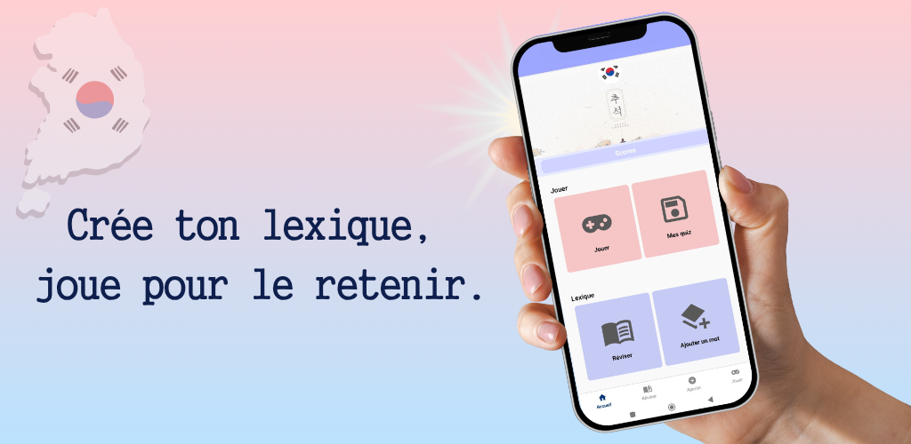
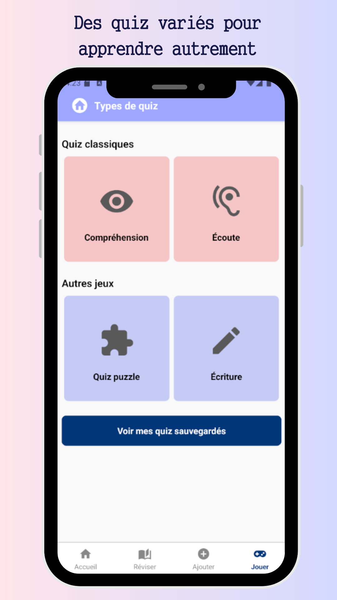

# 🇰🇷 HangeulGo

**HangeulGo** est une application mobile éducative pour apprendre le vocabulaire coréen de façon ludique et interactive.

Constituez votre propre lexique, en ajoutant les mots que vous souhaitez apprendre. 🇰🇷

Une liste de vocabulaire de base est disponible pour bien démarrer (salutations, nombres, expressions courantes), mais chacun est libre de personnaliser totalement son expérience.
Vous pourrez ensuite jouez à des quizs personnalisés depuis ce lexique, avec deux types d'exercices :

- Traduction (français → coréen), en QCM ou en saisie libre
- Compréhension (coréen → français)

Vous pouvez personnalisez vos quiz en associant des mots clés à vos mots.

## Sommaire

- [Aperçu](#aperçu)
- [Fonctionnalités](#fonctionnalités)
- [Stack technique](#stack-technique)
- [Lancer l'application localement](#lancer-lapplication-localement)
- [Crédits images](#crédits-images)
- [Créatrice](#créatrice)
- [Licence](#licence)

## Aperçu

## Fonctionnalités

- **Lexique personnalisable**
  - Ajout de mots avec traduction, phonétique, niveau de difficulté et thèmes
  - Tri et filtres
  - Activation/désactivation des mots
  - Édition et suppression de mots

- **Quiz interactifs**
  - Traduction (FR → KO) : en QCM ou saisie libre
  - Compréhension (KO → FR)
  - Durées de jeu personnalisables : court, normal, long
  - Filtres par difficulté et thèmes
  - Génération aléatoire des questions

- **Résultats et progression**
  - Score final avec médaille (or, argent, bronze)
  - Historique des scores

- **Paramètres persistants**
  - Sauvegarde des derniers réglages

- **Mode hors-ligne complet**
  - L’app fonctionne sans connexion
  - Toutes les données sont locales 

## Stack technique

- **Framework** : React Native + Expo
- **Langage** : TypeScript
- **Base de données locale** : `expo-sqlite`
- **Persistance légère** : `expo-sqlite/kv-store`
- **Build / Déploiement** : `EAS Build` (Expo Application Services)
- **Traduction automatique (optionnelle)** : Azure Translator API via Cloudflare Worker sécurisé

## Lancer l'application localement

### Développement

1. Installation des dépendances
``npm i``

2. Lancement en local
``npm start``

3. Lancement sur un émulateur android
``npm run android``

### Déploiement

1. Connexion au compte Expo
``npx expo login``

2. Lancement du build APK
``npx eas build -p android --profile preview``

2. Lancement du build AAB pour le Play Store
``npx eas build -p android --profile production``

3. Mise à jour sans **rebuild complet**
``npx eas update --branch preview``

## Crédits images

Certaines illustrations utilisées dans **HangeulGo** proviennent de [Freepik](https://www.freepik.com) et sont utilisées sous licence gratuite avec attribution :

- Illustrations par [pikisuperstar](https://www.freepik.com/author/pikisuperstar)
- Illustrations par [kstudio](https://www.freepik.com/author/kstudio)
- Illustrations par [wirestock](https://www.freepik.com/author/wirestock)
- Illustrations par [tawatchai07](https://www.freepik.com/author/tawatchai07)
- Illustrations par [Freepik](https://www.freepik.com)
- Certaines illustrations proviennent également de [Canva](https://www.canva.com) et sont utilisées conformément à leurs conditions d’utilisation.

Attribution conforme aux conditions d'utilisation Freepik pour les applications mobiles.

## Créatrice

Conçu et développé avec passion par [Samantha Deschaepmeester](mailto:deschaepmeester.samantha@gmail.com) 👩‍💻

## Licence

Le code source de **HangeulGo** est publié sous licence [MIT](LICENSE).

⚠️ Les illustrations, images, polices et contenus graphiques présents dans ce dépôt sont **protégés** et **ne peuvent pas être réutilisés ou redistribués** sans autorisation.

Les fichiers provenant de [Freepik](https://www.freepik.com), [Canva](https://www.canva.com) ou toute autre ressource sous licence restent soumis à leurs conditions d'utilisation respectives.

## Politique de confidentialité

Vous pouvez consulter la politique de confidentialité de l'application HangeulGo à cette adresse :  
[https://sdeschaepmeester.github.io/hangeulgo-privacy/](https://sdeschaepmeester.github.io/hangeulgo-privacy/)

Aucune donnée personnelle n’est transmise à un serveur ou à un tiers.