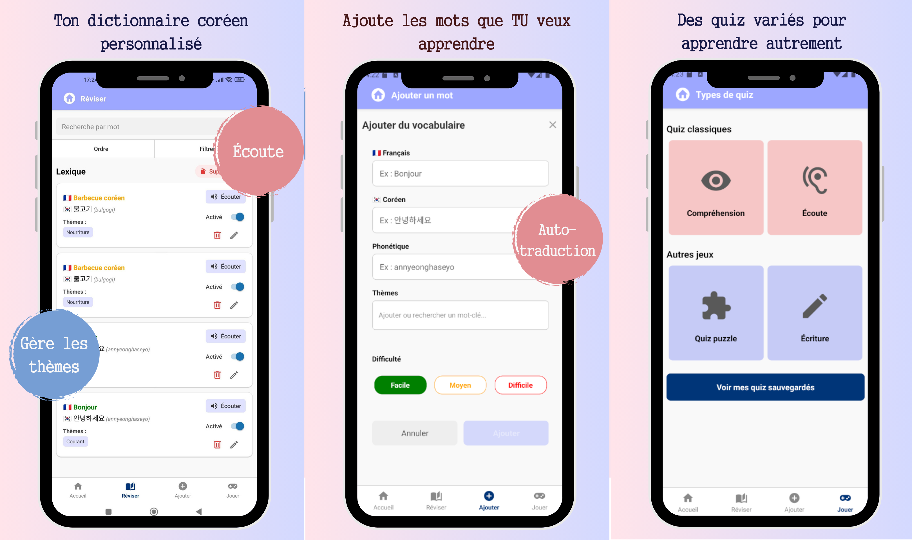
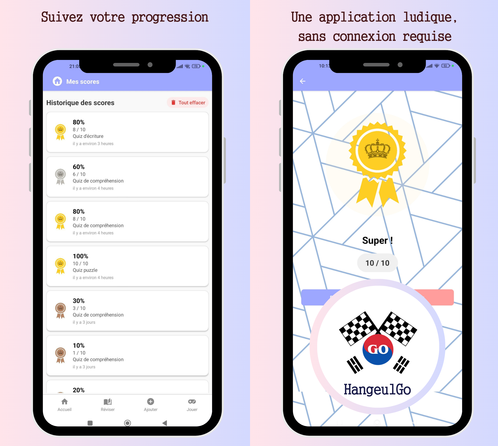

# 🇰🇷 HangeulGo

🇫🇷 [Consulter la version française](./README.fr.md)

**HangeulGo** is a fun and interactive mobile app to learn Korean vocabulary.

Build your own custom lexicon by adding the words you want to learn. 🇰🇷

A basic vocabulary list is available to get you started (greetings, numbers, common expressions), but you’re free to fully customize your experience.  
You can then play personalized quizzes from your lexicon with two types of exercises:

- Translation (French → Korean), in multiple choice or free input mode  
- Comprehension (Korean → French)

You can personalize your quizzes by assigning keywords (themes) to your words.

## Table of Contents

- [Preview](#preview)
- [Features](#features)
- [Tech Stack](#tech-stack)
- [Run the app locally](#run-the-app-locally)
- [Image credits](#image-credits)
- [Creator](#creator)
- [License](#license)

## Preview

## Features

- **Customizable lexicon**
  - Add words with translation, phonetic, difficulty level and tags
  - Sort and filter
  - Enable/disable words
  - Edit and delete entries

- **Interactive quizzes**
  - Comprehension (FR → KO or KO → FR)
  - Listening (FR → KO or KO → FR)
  - Translation (FR → KO)
  - Puzzle
  - Customizable durations: short, normal, long
  - Filter by difficulty and tags
  - Random question generation

- **Quiz saving**
  - Save quiz settings to replay them easily

- **Results and progression**
  - Final score with medal (gold, silver, bronze)
  - Score history

- **Persistent settings**
  - Saves your last-used settings

- **Fully offline**
  - Works without internet
  - All data is stored locally

## Tech Stack

- **Framework**: React Native + Expo  
- **Language**: TypeScript  
- **Local database**: `expo-sqlite`  
- **Lightweight storage**: `expo-sqlite/kv-store`  
- **Build / Deployment**: `EAS Build` (Expo Application Services)  
- **Optional translation**: Azure Translator API via secured Cloudflare Worker

## Run the app locally

### Development

1. Install dependencies  
``npm i``

2. Start the local server  
``npm start``

3. Run on Android emulator  
``npm run android``

4. Check app health 
``npx expo-doctor``

5. Check dependencies 
``npx expo install --check``

### Deployment

1. Log in to Expo account  
``npx expo login``

2. Build an APK  
``npx eas build -p android --profile preview``

3. Build an AAB for Play Store  
``npx eas build -p android --profile production``

4. Push an update without full rebuild  
``npx eas update --branch preview``

## Image credits

Some illustrations used in **HangeulGo** come from [Freepik](https://www.freepik.com) and are used under the free license with attribution:

- Illustrations by [pikisuperstar](https://www.freepik.com/author/pikisuperstar)
- Illustrations by [kstudio](https://www.freepik.com/author/kstudio)
- Illustrations by [wirestock](https://www.freepik.com/author/wirestock)
- Illustrations by [tawatchai07](https://www.freepik.com/author/tawatchai07)
- Illustrations by [Freepik](https://www.freepik.com)
- Some illustrations also come from [Canva](https://www.canva.com) and are used in accordance with their terms of service.

Attribution complies with Freepik’s mobile app usage conditions.

### Sound effects credits
Some sound effects in **HangeulGo** are from [Pixabay](https://pixabay.com/) and used under free license with attribution:

- Sound Effect by <a href="https://pixabay.com/users/universfield-28281460/?utm_source=link-attribution&utm_medium=referral&utm_campaign=music&utm_content=132126">Universfield</a> from <a href="https://pixabay.com/sound-effects//?utm_source=link-attribution&utm_medium=referral&utm_campaign=music&utm_content=132126">Pixabay</a>
- Sound Effect by <a href="https://pixabay.com/users/tuomas_data-40753689/?utm_source=link-attribution&utm_medium=referral&utm_campaign=music&utm_content=199825">Tuomas_Data</a> from <a href="https://pixabay.com/sound-effects//?utm_source=link-attribution&utm_medium=referral&utm_campaign=music&utm_content=199825">Pixabay</a>
- Sound Effect by <a href="https://pixabay.com/users/freesound_community-46691455/?utm_source=link-attribution&utm_medium=referral&utm_campaign=music&utm_content=47985">freesound_community</a> from <a href="https://pixabay.com//?utm_source=link-attribution&utm_medium=referral&utm_campaign=music&utm_content=47985">Pixabay</a>
- Sound Effect by <a href="https://pixabay.com/users/u_3bsnvt0dsu-48554563/?utm_source=link-attribution&utm_medium=referral&utm_campaign=music&utm_content=295086">u_3bsnvt0dsu</a> from <a href="https://pixabay.com//?utm_source=link-attribution&utm_medium=referral&utm_campaign=music&utm_content=295086">Pixabay</a>

## Creator

Designed and developed with love by [Samantha Deschaepmeester](mailto:deschaepmeester.samantha@gmail.com) 👩‍💻

## License

The source code of **HangeulGo** is released under the [MIT](LICENSE) license.

⚠️ All illustrations, images, fonts, and graphic content in this repository are **protected** and **may not be reused or redistributed** without permission.

Assets from [Freepik](https://www.freepik.com), [Canva](https://www.canva.com), or any other licensed source remain subject to their respective terms.

## Privacy Policy

You can view the HangeulGo app's privacy policy here:  
[https://sdeschaepmeester.github.io/hangeulgo-privacy/](https://sdeschaepmeester.github.io/hangeulgo-privacy/)

No personal data is shared with a server or any third party.
